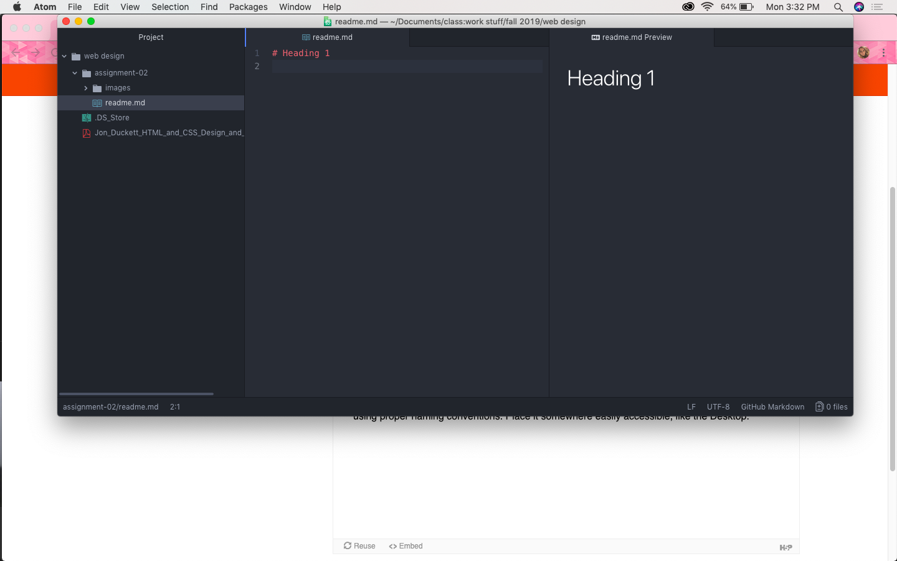

# Assignment 2
## Lily Johnson

I am taking Intro to Web Design because it's required for my major in Media Arts. I think it'll be useful to my education because I hope to become a designer of some sort.

#### Things I'm hoping to learn
- I hope to be able to create a website for my design portfolio.
- I want to learn techniques for making a well-designed website.
- I hope to gain a better understanding of HTML and CSS.

[twitter](https://twitter.com)

[my responses](./responses.txt)

