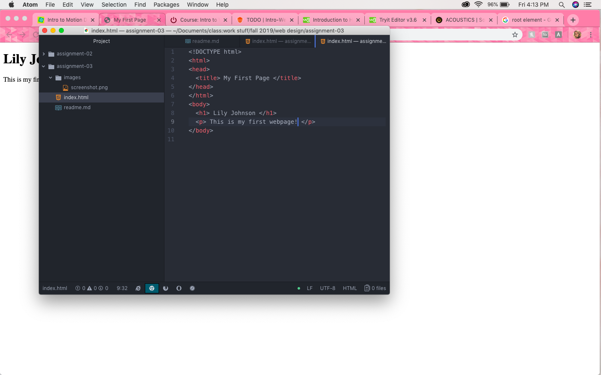

# Assignment 3
## Lily Johnson

1. When using a browser, your computer sends a request to a server, which sends web content back to you. Then, the browser translates that content into a page that you can view.

2. A markup language is in charge of the structure of the page. It focuses on text rather than images or design. One common markup language is HTML, which is the most commonly used web language. It sets the foundation of a pages content, which can then be modified by using stylesheets, like CSS.

