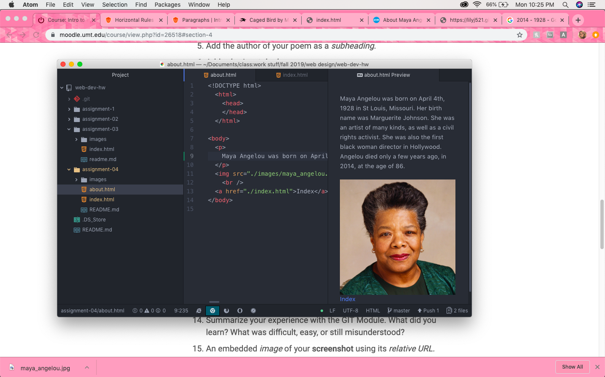

1. I visited Yahoo.com in December 1996. The formatting and design of the page was much more simple. It was mostly just hyperlinks in HTML format, with no styling at all. Today Yahoo.com is a lot more stylistically complex, and includes a lot more images than the Yahoo of 1996.
2. My experience with the GIT module wasn't too difficult, as I already had used Github in my previous creative coding class. It's been a while though, so I had some trouble remembering how to locate my repository and such.

