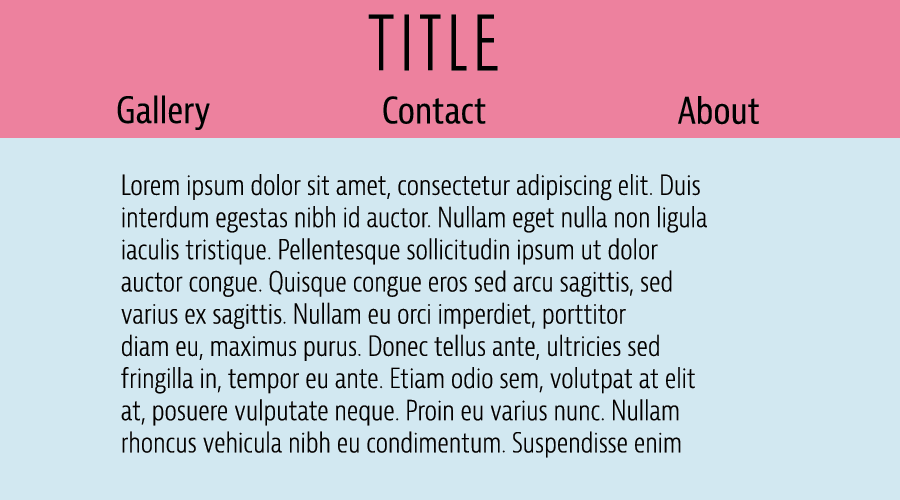

What is the difference between padding, margin, and borders?
Padding is space around the text within a box, margin is space around the box itself, and a border is a line around the box.
Embed the image of your sketch.

Free Response: Summarize your work cycle for this assignment.
For this assignment, I looked at some website styles, and then followed the walkthrough, while checking back into the module for help as I went. I also revisited the typography module for help at times.
